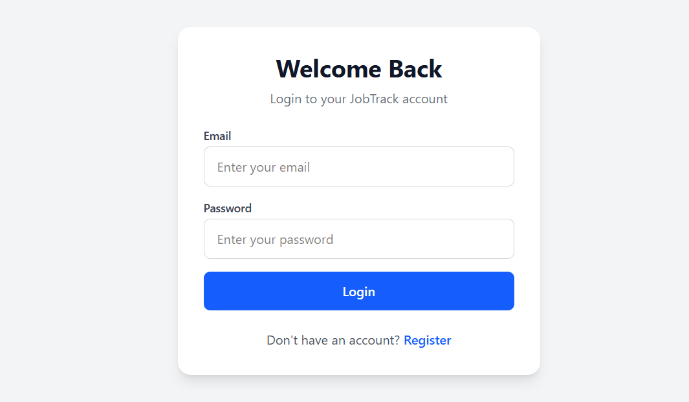
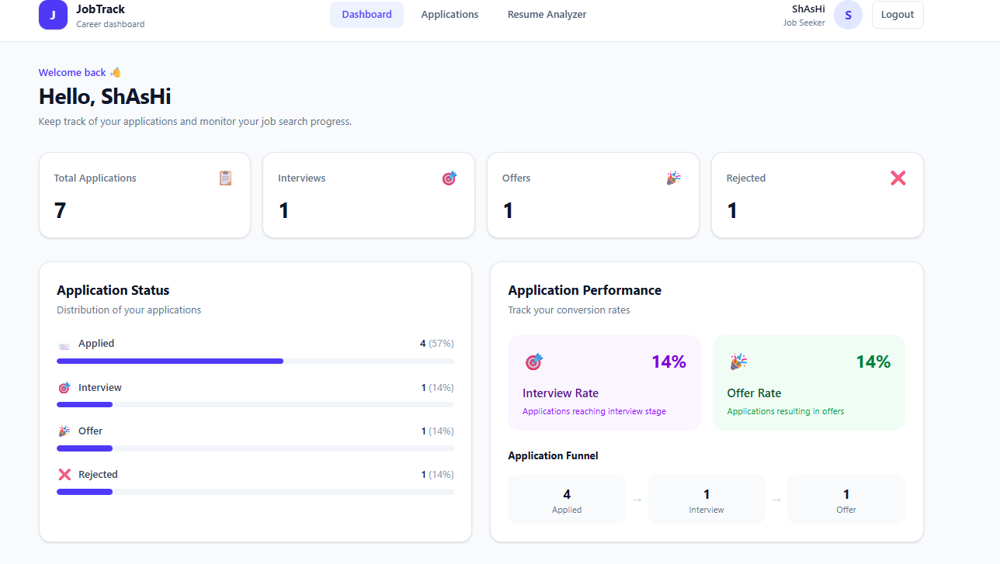
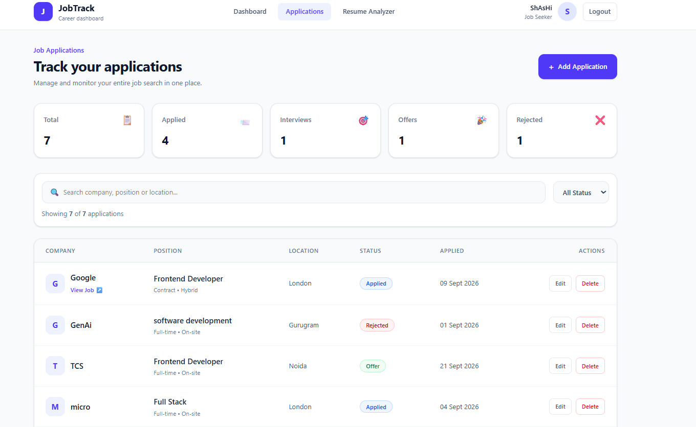
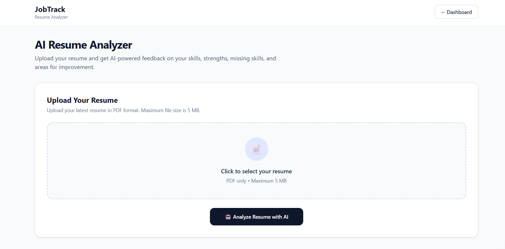

# JobTrack 🚀

A full-stack Job Application Tracker built with the MERN stack that helps users manage job applications, track application status, and analyze resumes using AI.

## 🌐 Live Demo

- **Frontend:** https://job-track-plum.vercel.app/
- **Backend API:** https://jobtrack-hhly.onrender.com/

## ✨ Features

- 🔐 User Registration & Login
- 🔑 JWT-based Authentication
- 📊 Job Application Dashboard
- ➕ Add Job Applications
- ✏️ Edit Job Applications
- 🗑️ Delete Job Applications
- 🔎 Search and Filter Applications
- 📈 Application Statistics & Analytics
- 📄 Resume PDF Upload
- 🤖 AI-powered Resume Analysis using Gemini
- 📋 Resume Score, Strengths & Improvement Suggestions
- 🛡️ Protected Routes
- 🌐 Responsive UI

## 🛠️ Tech Stack

### Frontend

- React.js
- React Router DOM
- Tailwind CSS
- Axios
- Vite

### Backend

- Node.js
- Express.js
- MongoDB
- Mongoose
- JWT
- bcryptjs
- Multer

### AI

- Google Gemini API

### Deployment

- Vercel — Frontend
- Render — Backend
- MongoDB Atlas — Database

## 📸 Screenshots

### Login



### Dashboard



### Applications



### Resume Analyzer



## 📁 Project Structure

```text
JobTrack/
│
├── backend/
│   ├── config/
│   ├── controllers/
│   ├── middleware/
│   ├── models/
│   ├── routes/
│   ├── uploads/
│   ├── .env.example
│   ├── package.json
│   └── server.js
│
├── frontend/
│   ├── public/
│   │   └── screenshots/
│   ├── src/
│   │   ├── components/
│   │   ├── context/
│   │   ├── pages/
│   │   ├── services/
│   │   ├── App.jsx
│   │   └── main.jsx
│   ├── .env.example
│   ├── package.json
│   └── vercel.json
│
└── README.md
